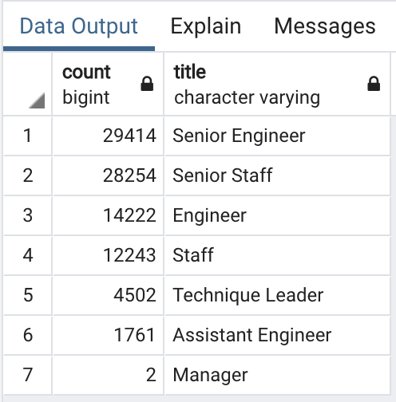

# Pewlett-Hackard-Analysis

## Overview of the Pewlett-Hackard analysis

The purpose of this project is:
* To determine the number of retiring employees per title.
* To identify employees who are eligible to participate in a mentorship program.
* To summarize the analysis and help the manager prepare for the **"silver tsunami"**, as many current employees reach retirement age.

## Results

These are the observations from the Pewlett-Hackard analysis :

* **90,398** employees are ready to be retired in the four years. 
That is a huge number of employees to be filled up in a short amount of time.

* Out of the total ready-to-retire employees, **29,414** are *Senior Engineers* and **28,254** are *Senior Staffs* who will be retired in the next 4 years. That is a huge number for two titles to be filled up in four years.

* The total number of employees those are eligible for mentorship program are only **1,549**. It is a very small number compared to the total number of employees eligible for retirement.

* There are **169** *Senior Engineers*, **569** *Senior Staffs* and **zero** *Managers* identifed for the mentorship eligible program. These numbers are very insignificant compared to the retirement numbers.

## Summary

### A. High level analysis to address the questions in Pewlett-Harward project:

#### 1) How many roles will need to be filled as the "silver tsunami" begins to make an impact?

- **90,398** roles has to be filled in the next **four** years as the **"silver tsunami"** begins to make an impact.

#### 2) Are there enough qualified, retirement-ready employees in the departments to mentor the next generation of Pewlett Hackard employees?

- Yes. There are many retirement-ready employees in every department to mentor next generation of Pewlett Hackard employees. However there are not enough mentorship-eligible employees to be mentored.

The below table shows the total count of retirement-ready employees per department.

**Retirement Ready Employees per Department:**

### B. Queries to provide additional insight ino the upcoming "silver tsunami"

#### 1) The below query helps us provide the number of retirement-ready employees that we saw in the earlier section.

It can be seen that there are huge number of employees per department who are retirement ready and eligible to provide mentorship.

**Query to extract Retirement Ready Employees per Department:**

#### 2) The below query along with the table will help us provide the number of mentorship eligible employees by department.

It can be seen that the number of employees who are eligible for mentorship is very less compared to the employees who are ready to retire. This is very alarming. To face the **"silver tsunami"** the gap between the employees retiring and employees ready to be mentored should be met by retruiting more employees.

**Query and Table to extract employees eligible for mentorship by department:**

#### 3) The mentorship eligibility criteria can be extended to include employees who has birth-date starting from '1961-01-01' to '1965-12-31'

It will increase the number of employees getting trained by ready-to-retire employees and will make the company better prepared to face the **"silver tsunami"**.

**Extended Mentorship Eligibility query and table:**

